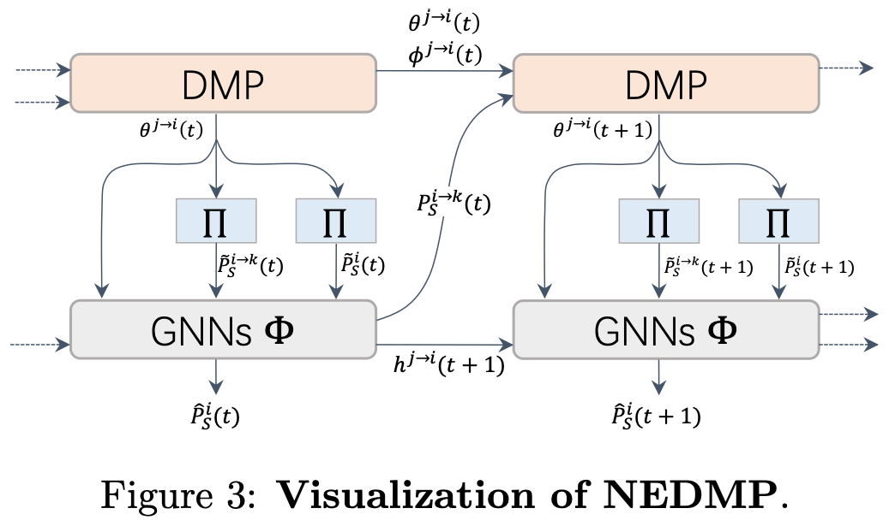

# NEDMP: Neural Enhanced Dynamic Message Passing

This is a PyTorch implementation of paper ***[Neural Enhanced Dynamic Message Passing](https://arxiv.org/abs/2202.06496)*** in AISTATS 2022.

## Abstract
Predicting stochastic spreading processes on complex networks is critical in epidemic control, opinion propagation, and viral marketing. We focus on the problem of inferring the time-dependent marginal probabilities of states for each node which collectively quantifies the spreading results. Dynamic Message Passing (DMP) has been developed as an efficient inference algorithm for several spreading models, and it is asymptotically exact on locally tree-like networks. However, DMP can struggle in diffusion networks with lots of local loops. We address this limitation by using Graph Neural Networks (GNN) to learn the dependency amongst messages implicitly. Specifically, we propose a hybrid model in which the GNN module runs jointly with DMP equations. The GNN module refines the aggregated messages in DMP iterations by learning from simulation data. We demonstrate numerically that after training, our model's inference accuracy substantially outperforms DMP in conditions of various network structure and dynamics parameters. Moreover, compared to pure data-driven models, the proposed hybrid model has a better generalization ability for out-of-training cases, profiting from the explicitly utilized dynamics priors in the hybrid model.
<p align="center">
  
</p>

## Requirements
OS:
- Ubuntu

Python packages:
- troch==1.9.1
- torch-geometric>=2.0

## Code
We provide bash scripts (at `./bashs`) for generating all datasets used in our paper and running all experiments (as well as hyper parameters) conducted in our paper.

We implementate DMP using PyTorch at `./src/DMP/SIR.py`, and the code for NEDMP and baseline GNN at `src/model`.

## Citation

```
@inproceedings{Gao2022NEDMPNE,
  title={Neural Enhanced Dynamic Message Passing},
  author={Fei Gao and Yan Zhang and Jiang Zhang},
  booktitle={AISTATS},
  year={2022}
}
```

